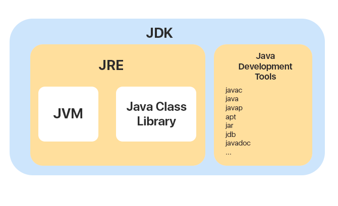

микросервисы VS монолит???

**JDK JRE JVM**

JDK (Java Development Kit) — Включает в себя компилятор, стандартные библиотеки классов Java, примеры, документацию, утилиты и JRE.

JRE (Java Runtime Environment) — Минимальная реализация виртуальной машины, необходимая для исполнения Java-приложений.  

JVM (Java Virtual Machine) — Выполняет байт-код Java, который генерируется компилятором Java (javac) из исходного кода программы.

**Терминальные завершающий stream api** —
Терминальный метод запускает цепочку преобразований, закрывают поток и возвращают модифицированные данные.  

- .collect()
- .forEach()
- .count()
- .min()/.max()
- .find...()
- ....Match()

**Concurrency** —

потокобезопасные коллекции java

Реактивное программирование – парадигма программирования, которая основывается на запрограммированных действиях, запускаемых в связи с событиями, а не на хронологическом порядке кода. Реактивные программы эффективно используют компьютерные ресурсы и хорошо масштабируются всего несколькими потоками. Его непоследовательная форма позволяет избежать блокировки стека и поддерживать оперативность реагирования.  

**Оркестрация** — 
единый центр управления, который «дирижирует всем оркестром», 
направляя запросы к различным микросервисам в зависимости от обрабатываемой бизнес-логики. 

**Хореография** —
каждый микросервис определяет свои действия самостоятельно, основываясь на полученных события или же реактивно: по реакции на определенный набор событий.

**Service Discovery** —
Ведет журнал в котором серверы и компоненты инфраструктуры сообщают о своих адресах и состоянии, как только они появляются в кластере.
Механизм для вызова сервисов без жесткого кодирования их имен узлов или номеров портов.

Пару слов о eureka???  
Service registry???

**Аспектно ориентированное программирование** — AOП-это метод программирования, который позволяет программистам модулировать поведение, используемое в типичных подразделениях ответственности, используемых в объектно-ориентированном программировании. Основная конструкция аспектов AOП – это поведение, применимое к разным классам. Извлечение этих моделей поведения из отдельных компонентов в аспекты позволяет легко использовать их повторно.  

Парадигма программирования предназначенная для декомпозиции — это разбиение сложной проблемы или системы на части, которые легче представить, понять, запрограммировать и поддерживать.

https://logrocon.ru/news/aop

**@qualifier** spring
**@Primary** spring

# **Транзакции**

**Транзакции** —
Объединение операций, для выполнения всех, либо ни одной.

**Транзакции в SQL**
- BEGIN — создать новую транзакцию  
- COMMIT — сохранить изменения в БД  
- ROLLBACK — отменить изменения  

**Уровни изоляции транзакции** —

- READ_UNCOMMITTED — Могут происходить грязные чтения, неповторяемые чтения, фантомные чтения и потерянное обновление.  
- READ_COMMITTED — Грязные чтения предотвращены, но могут возникать неповторяющиеся чтения, фантомные чтения и потерянное обновление.  
- REPEATABLE_READ — Грязные чтения, неповторяющиеся чтения и потерянное обновление предотвращены, но могут возникать фантомные чтения.  
- SERIALIZABLE — Транзакции полностью изолированы. Исключено влияние одной транзакции на другую в момент выполнения.  

**Режимы изоляции** —

- Потерянное обновление — Две параллельные транзакции меняют одни и те же данные. Итоговый результат обновления предсказать невозможно.
- «Грязное» чтение — В результатах запроса появляются промежуточные результаты параллельной транзакции, которая ещё не завершилась.
- Неповторяющееся чтение — Запрос с одними и теми же условиями даёт неодинаковые результаты в рамках транзакции.
- Фантомное чтение — В результатах повторяющегося запроса появляются и исчезают строки, которые модифицирует параллельная транзакция.

Чем выше уровень изоляции, тем большей производительностью вы жертвуете.

**ACID**
Атомарность (Atomicity) гарантирует, что никакая транзакция не будет зафиксирована в системе частично. Будут либо выполнены все операции, либо ни одной.

Согласованность (Consistency). Каждая успешная транзакция фиксирует только допустимые результаты и база остается консистентной.  
консистентность данных???  
Изолированность (Isolation). Во время выполнения транзакции, параллельные транзакции не должны оказывать влияние на её результат.

Устойчивость (Durability). Независимо от проблем с оборудованием, изменения, сделанные успешно завершённой транзакцией, должны остаться сохранёнными после возвращения системы в работу.

**Интерфейс для управления транзакциями** —
Spring предлагает вам интерфейс PlatformTransactionManager / TransactionManager, который по умолчанию поставляется с парой удобных реализаций. Одна из них – DataSourceTransactionManager.

inline kotlin что это
реактивное программирование библиотеки
ingress kubernetes это

Реактивное программирование
Restful
Rest vs grpc
Redis?