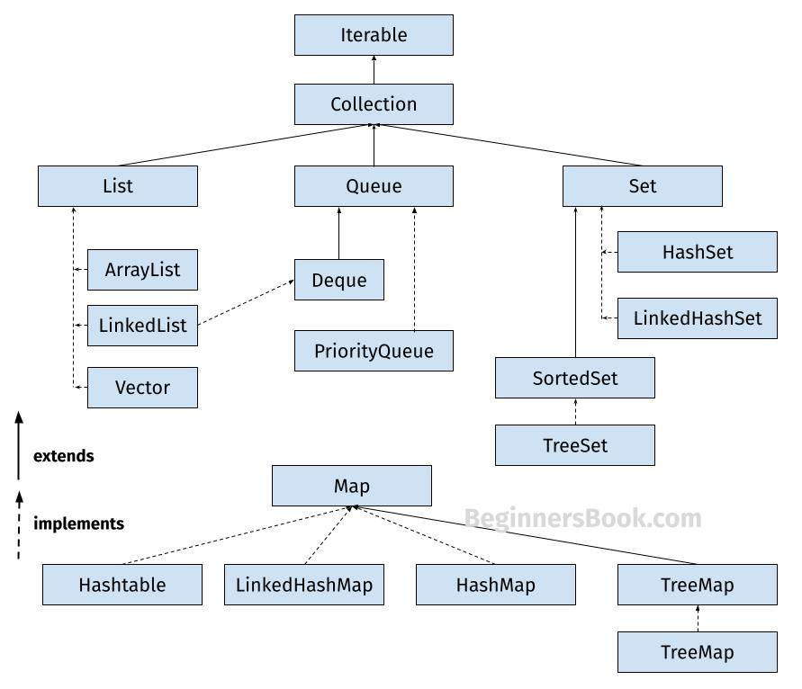
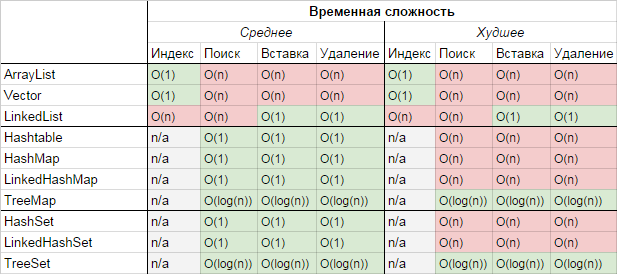

# **JDK JRE JVM**


JDK (Java Development Kit) — Включает в себя компилятор, стандартные библиотеки классов Java, примеры, документацию, утилиты и JRE.  
JRE (Java Runtime Environment) — Минимальная реализация виртуальной машины, необходимая для исполнения Java-приложений.  
JVM (Java Virtual Machine) — Выполняет байт-код Java, который генерируется компилятором Java (javac) из исходного кода программы.  

# Collections


**ArrayList VS LinkedList?**

- **ArrayList** - это список на основе массива.  
1. Быстрый доступ по индексу, так как эти операции выполняются за константное время. Добавление в конец списка в среднем тоже выполняется за константное время. Кроме того в ArrayList нет дополнительных расходов на хранение связки между элементами. 
2. Минусы в скорости вставки/удаления элементов находящихся не в конце списка, так как при этой операции все элементы правее добавляемого/удаляемого сдвигаются.

- **LinkedList** - связанный список на основе элементов и связи между ними(если часто вставляете/удаляете).  
1. Удобен когда важнее быстродействие операций вставки/удаления, которые в LinkedList выполняются за константное время. 
2. Операции доступа по индексу производятся перебором с начала или конца (смотря что ближе) до нужного элемента. Дополнительные затраты на хранение связки между элементами.

# HashMap
HashMap состоит из bucket`ов, «bucket» — это элементы массива, которые хранят ссылки на списки элементов. 
При добавлении новой пары ключ-значение, вычисляет хеш-код ключа, на основании хеш-кода вычисляется номер корзины, в которую добавится новый элемент. 
1. Корзина пустая - в нее сохраняется ссылка на новый элемент.
2. Есть элемент - последовательно переходим по ссылкам между элементами в цепочке, до последнего элемента, от которого и ставится ссылка на новый элемент. 
3. Если в списке был найден элемент с таким же ключом - он заменяется. 

**HashMap** - хранение данных в виде пар ключ/значение, где у ключей есть хэши, то есть числовые уникальные идентификаторы. Они высчитываются для каждого ключа.

**HashMap vs TreeMap**

Сходства:
* Реализуют java.util.Map интерфейс.
* Реализации HashMap, а также TreeMap не синхронизированы, Collections.synchronizedSortedMap() - синхронизированный доступ

Отличия:
* HashMap использует хеш-таблицу, TreeMap реализовано с помощью красно-черного дерева.
* Порядок итерации HashMap не определен, тогда как элементы TreeMap упорядочены с использованием их естественного порядка или в соответствии с указанным Компаратором.
* Сложность методов get, put, containsKey, remove в HashMap O(1), в TreeMap - O(log(n))
* HashMap допускает нулевые значения и нулевые ключи, тогда как TreeMap разрешает только нулевые значения (не нулевые ключи), если используется естественный порядок ключей. Он поддерживает нулевые ключи только в том случае, если его компаратор поддерживает сравнение нулевых ключей.

- HashMap когда производительность критична, а порядок ключей не имеет значения.
- TreeMap когда ключи необходимо упорядочить, используя их естественный порядок или с помощью компаратора.
- LinkedHashMap если порядок вставки ключей должен быть сохранен.
- TreeMap - Бинарный поиск, потому что всегда делим на половину

**Деревья**:
- Обычное дерево - сколько угодно, любое кол-во наследников
- Бинарное - два наследника, худшая сложность O(n), потому что может стать 'массивом', если все элементы добавляются направо
- Красно-черное дерево - не позволяет стать 'списком'
- B-дерево - O(log n) хранит много ключей в одном узле и ссылается на несколько дочерних узлов. Это уменьшает высоту дерева и, обеспечивает более быстрый доступ к диску.

# Big O


**Методы Object**
- toString()
- equals()
- hashCode()
- wait()
- notify()
- notifyAll()
- finalize() — deprecated в Java 9+
- getClass()

**Терминальные завершающий stream api** —
Терминальный метод запускает цепочку преобразований, закрывают поток и возвращают модифицированные данные.
- .collect()
- .forEach()
- .count()
- .min()/.max()
- .find...()
- ....Match()

**Что такое string-pool? В чем отличие cоздания строки через new от литерала? Что такое String.intern()?**  
string-pool — структура в памяти, хранящая массив всех строк-литералов программы.
String.intern(), соответственно, вернет строку из пула, при наличии таковой. Полезно при сравнениях вида:

```new String("hello").intern() == new String("hello").intern()```

Т.к без интернирования пришлось бы сравнивать строки через equals, что может быть медленнее при наличии длинных строк. В данном случае возвращается ссылка на один и тот же объект строки из пула, и проверка проходит с true.

**Почему хранить пароль предпочтительнее в char[]/byte[], а не в String**  
Строка в виде литерала сразу раскрывает пароль, плюс она всегда хранится в string-пуле  
byte[]/char[] возможно сбросить после использования, и удалить все ссылки на него  

**В чем хранить деньги Float/Double???**  

**Привести пример плохой реализации hashCode()**  
Метод, возвращающий константу, или значения хэшкодов с неравномерным распределением, приводящим к коллизиям

**Сравнение по == и по equals**  
Сравнение по "==" — сравнение по ссылкам  
Сравнение по «equals» — если переопределен equals, то это сравнение эквивалентности объектов по их полям, если нет — по ссылкам на объекты  

**Interface vs Abstract Class.**  
Интерфейс есть средство наследования API, абстрактный класс — средство наследования реализации  
Через интерфейсы возможно осуществлять множественное наследование, абстрактный класс можно наследовать в одном экземпляре.  
В интерфейсе нет возможности определить поля и конструкторы  

**Новые возможности Java 9 — 11**
- Новые методы в String
- Java 9: Модульность
- Java 9: Методы в Objects: requireNonNullElse() и requireNonNullElseGet()
- Java 9: List.of(), Set.of(), Map.of(), Map.ofEntries()
- Java 9: Stream.takeWhile(), Stream.dropWhile(), Stream.iterate()
- Java 9: Optional.ifPresentOrElse(), Optional.stream()
- Java 10: var type-inference
- Java 11: Files.readString(), Files.writeString()
- Java 11: Local-Variable Syntax for Lambda Parameters — выведение типов у var-аргументов в лямбда-параметрах
- Java 11: HTTP Client

Есть synchronize static public method, что будет монитором для него???  
dump memory???  


**Примитивы java размер**  

| Примитив | Размер (в байтах) |
|----------|-------------------|
| byte     | 1                 |
| short    | 2                 |
| int      | 4                 |
| long     | 8                 |

**SOLID**

S — Каждый класс должен иметь только одну зону ответственности.  
O — Классы должны быть открыты для расширения, но закрыты для изменения.  
L — Функции, которые используют родительский класс, должны иметь возможность использовать классы наследники не зная об этом.  
I — Не следует ставить клиент в зависимость от методов, которые он не использует.  
D — Модули верхнего уровня не должны зависеть от модулей нижнего уровня. И те, и другие должны зависеть от абстракции. Абстракции не должны зависеть от деталей. Детали должны зависеть от абстракций.

### Реализация очереди на двух стеках

**Стек** реализует принцип LIFO (last in — first out, «последним пришёл — первым вышел»).
- push — положить элемент на стек
- pop — достать элемент из стека

**Очередь** — это структура данных с доступом к элементам FIFO (First In, First Out – «первым пришёл — первым ушёл»)
- push — положить элемент в конец очереди
- pop — достать элемент из начала очереди

Посмотреть - https://www.youtube.com/watch?v=SW_UCzFO7X0


----


**В чем хранить деньги в Java: Float или Double?**  

Для хранения денежных значений в Java не рекомендуется использовать типы данных `Float` или `Double` из-за проблем с точностью. Вместо этого рекомендуется использовать `BigDecimal`, который обеспечивает высокую точность и предотвращает ошибки округления.

Пример использования `BigDecimal`:

-----

Переход с Java 8 на Java 11 имеет несколько преимуществ:

1. **Поддержка**: Java 11 является LTS (Long-Term Support) версией, что означает, что она будет получать обновления и исправления безопасности в течение длительного времени.
2. **Новые функции**: Java 11 включает множество новых функций и улучшений, таких как локальные переменные для лямбда-выражений, улучшенная поддержка HTTP/2, новые методы в API строк и многое другое.
3. **Производительность**: В Java 11 были внесены улучшения в производительность и оптимизацию, что может привести к более быстрому выполнению приложений.
4. **Безопасность**: Java 11 включает в себя множество исправлений безопасности и улучшений, что делает её более безопасной по сравнению с Java 8.
5. **Модульность**: Java 11 продолжает развивать модульную систему, введенную в Java 9, что позволяет лучше управлять зависимостями и улучшать структуру приложений.
6. **Удаление устаревших компонентов**: В Java 11 были удалены некоторые устаревшие и ненужные компоненты, что делает платформу более легкой и современной.

-----

В Java, если метод объявлен как `synchronized static`, монитором для него будет объект класса `Class`, к которому этот метод принадлежит. Это означает, что блокировка будет происходить на уровне класса, а не на уровне экземпляра объекта. Например, если у вас есть класс `MyClass` с `synchronized static` методом, то монитором будет `MyClass.class`.

-----

**Dumps**:
- **Dump memory** — это процесс записи содержимого оперативной памяти в файл для последующего анализа. Это может быть полезно для отладки и диагностики проблем в приложении.
- **Heap dump**: Снимок состояния кучи памяти JVM, который включает все объекты, находящиеся в памяти на момент создания дампа.
- **Thread dump**: Снимок состояния всех потоков в JVM, включая их стек вызовов, что помогает в диагностике проблем с многопоточностью.
- **Core dump**: Снимок состояния всей памяти процесса, включая регистры процессора и другие данные, полезные для низкоуровневой отладки.
- **Crash dump**: Снимок состояния системы или приложения в момент сбоя, который помогает в анализе причин аварийного завершения работы.

---

Какие существуют инструменты для мониторинга и оповещений в Java:

1. **Prometheus** — система мониторинга и оповещений с открытым исходным кодом, которая собирает и хранит метрики в формате временных рядов.
2. **Grafana** — платформа для визуализации данных, которая часто используется вместе с Prometheus для создания настраиваемых дашбордов.
3. **Elastic Stack (ELK)** — набор инструментов для поиска, анализа и визуализации данных в реальном времени, включающий Elasticsearch, Logstash и Kibana.
4. **Spring Boot Actuator** — библиотека для мониторинга и управления приложениями Spring Boot, предоставляющая метрики, информацию о состоянии и другие данные.

Эти инструменты помогают отслеживать состояние приложений, выявлять проблемы и своевременно реагировать на инциденты, обеспечивая стабильную работу систем на Java.


----

Сборщик мусора (Garbage Collection) - это автоматический процесс управления памятью в Java, который находит и удаляет объекты, которые больше не используются программой.

Основные виды сборщиков мусора в Java:

Serial GC:
- Однопоточный сборщик
- Подходит для небольших приложений
- Останавливает все потоки при сборке мусора

Parallel GC:
- Многопоточный сборщик
- Использует несколько потоков для сборки мусора
- По умолчанию в Java 8

CMS (Concurrent Mark Sweep):
- Минимизирует паузы в работе приложения
- Работает параллельно с основным приложением
- Сложный в настройке

G1 (Garbage First):
- Разделяет heap на регионы
- Приоритизирует регионы с большим количеством мусора
- По умолчанию с Java 9

ZGC:
- Масштабируемый сборщик с низкими задержками
- Работает с большими heap'ами
- Доступен с Java 11

----

Heap и Stack - две основные области памяти в JVM:

Heap:
- Область динамической памяти для хранения объектов
- Управляется сборщиком мусора
- Общая для всех потоков приложения
- Здесь хранятся экземпляры классов и массивы

Stack:
- Область для хранения локальных переменных и параметров методов
- Работает по принципу LIFO (последним пришел - первым вышел)
- Каждый поток имеет свой собственный стек
- Хранит примитивные типы и ссылки на объекты в heap

Хвостовая рекурсия (tail recursion) - это особый вид рекурсии, где рекурсивный вызов является последней операцией в методе.

Особенности хвостовой рекурсии:
- Рекурсивный вызов происходит в самом конце метода
- Не требуются дополнительные вычисления после рекурсивного вызова
- Компилятор может оптимизировать её в цикл
- Не приводит к переполнению стека

----

Модель памяти Java (JMM - Java Memory Model)

JMM определяет правила взаимодействия потоков с памятью в Java. Основные аспекты:

- Видимость (Visibility): Изменения, сделанные одним потоком, должны быть видны другим потокам
- Упорядочивание (Ordering): Порядок выполнения инструкций может быть изменен для оптимизации
- Атомарность (Atomicity): Некоторые операции выполняются как единое целое

Ключевые концепции JMM:

- happens-before отношение: Определяет порядок видимости операций между потоками
- volatile: Гарантирует немедленную видимость изменений для всех потоков
- synchronized: Обеспечивает атомарность и видимость изменений
- final: Гарантирует правильную инициализацию неизменяемых полей
