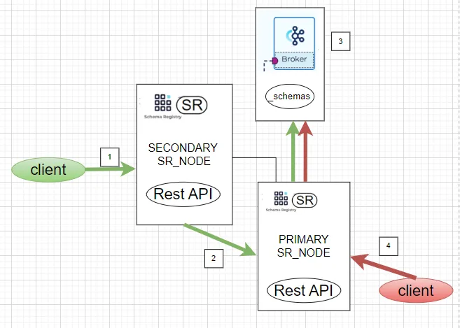

## KAFKA

**Apache Kafka** — 
это распределенная платформа потоковой передачи событий с открытым исходным кодом

**Admin Client** — 
полезен, когда требуется выполнять некоторые административные команды из клиентского приложения без использования инструментов CLI и GUI для управления Kafka.

**Topic** —
Канал для организации или хранения потоков данных.

**Compacted Topic** — 
хранится по одному значению в партиции, значения удаляются по ключу и оставляют самое позднее с таким ключом.

**Producer** —
Приложение или компонент, отправляющие сообщения в topic.

**Consumer** —
Приложение или компонент, читающее сообщения из topic.

**Partition** —
Физическое и упорядоченное хранилище сообщений внутри topic. Каждый topic может быть разделен на одну или несколько partition. Внутри partition сообщения являются логической последовательностью, упорядоченной по времени или ключам сообщений.

**Consumer Group** —
Логическая группа, состоящая из одного или нескольких consumers, которые работают совместно для чтения сообщений из topics. Каждая consumer group обрабатывает набор partitions в topic, причем каждая partition обрабатывается только одним consumer из группы.

Балансировка нагрузки kafka\Consumer Load Balancing
maintein ability

[Как Consumer читает сообщения???](https://www.youtube.com/watch?v=ovdSOIXSyzI)

### Оптимизация

-------------------------------------------------------------------
**Kafka compression** — сжатие данных с помощью различных кодеков – gzip/snappy
Минус оптимизации — увеличение загрузки ЦП на стороне потребителя за счет распаковки сжатых данных.

**Kafka Producer Batch** — объединение нескольких сообщений в пакет для отправки брокеру

-------------------------------------------------------------------
**Kafka acks** — указывает, сколько подтверждений должен получить продюсер, чтобы запись считалась доставленной брокеру

- 0, когда producer вообще не ждет никакого подтверждения, а сообщение считается в любом случае отправленным.
- 1, когда отправленное сообщение записывается в локальный журнал **лидера** на кластере Кафка, не ожидая полного подтверждения от всех остальных серверов
- -1 или all, когда producer ждет полной репликации сообщения по всем серверам кластера, что обеспечивает надежную защиту от потери данных, но увеличивает задержку (latency) и снижает пропускную способность.
  ВСЕ ИНСИНХ РЕПЛИКИ!

**Consumer Delivery Semantics:**  

- хотя бы 1 раз (at least once), когда отправитель сообщения получает подтверждение от брокера Kafka при значении параметра acks=all, что гарантирует однократную запись сообщения в топик Kafka. Но если отправитель не получил подтверждения по истечении определенного времени или получил ошибку, он может повторить отправку. При этом сообщение может быть дублировано, если брокер дал сбой непосредственно перед отправкой подтверждения, но после успешной записи сообщения в топик Kafka.
- не более 1-го раза (at most once), когда отправитель не повторяет отправку сообщения при отсутствии подтверждения или в случае ошибки. При этом возможна ситуация, что сообщение не записано в топик Кафка и не получено потребителем. На практике в большинстве случаев сообщения будут доставляться, но иногда возможна потеря данных.
- строго однократно (exactly once), когда даже при повторной попытке отправителя отправить сообщение, оно доставляется строго один раз. В случае ошибки, заставляющей отправителя повторить попытку, сообщение будет однократно записано в логе брокера Kafka. Это избавляет от дублирования или потери данных из-за ошибок на стороне producer’a или брокера Кафка. Чтобы включить эту функцию для каждого раздела следует задать свойство идемпотентности в настройках отправителя idempotence=true. Напомним, идемпотентной считается операций, которая при многократном выполнении даёт тот же результат, что и при однократном.

**commitSync** - блокирует поток до тех пор, пока не будет встречен либо коммит успешно, либо неустранимая ошибка  
**commitAsync** - встреченные ошибки либо передаются в callback (если он предусмотрен) или отбрасываются

**sync/in-sync** - синхронизована ли реплика с лидером

# **Confluent Schema Registry** 
**Confluent Schema Registry** – модуль Confluent для Kafka, который позволяет централизовано управлять схемами данных для сообщений в топиках.  
Consumer и Producer могут использовать эти схемы для обеспечения согласованности и совместимости данных по мере их эволюционного развития.  

- SR является прослойкой между Kafka и клиентским Producer/Consumer, а главная задача клиента и сервера SR — поддерживать совместимость между различными версиями сообщений и валидировать их согласно заданной схеме.
- SR хранит в себе текущую схему и всю историю изменений, работает с форматами сообщений Avro, Json, Protobuf и следит за обратной совместимостью передаваемых сообщений.
- SR имеет свой RESTfull интерфейс, который предоставляет доступ ко всем действиям над схемами сообщений (создание, чтение, удаление и тд).

**Взаимодействие без SR**
- Kafka работает с сообщениями в двоичном формате. Сообщение записывается и вычитывается в\из topic исключительно как byte array.
- За Serialization и Deserialization объекта отвечают Consumer и Producer.
- Consumer и Producer ничего не знают друг о друге. Отправляя сообщения producer не знает о том, кто будет его читать, и что гораздо важнее — какую структуру сообщения ожидает consumer.

**Как работает SR?**  
На примере связки Kafka + Schema Registry + Protobuf:

- В репозитории Producer Kafka создается, сохраняется и компилируется в объект‑структуру DTO схема Protobuf.proto;
- При отправке сообщения, либо клиент SR регистрирует схему и дает ей id версии. Или используется существующий id;
- Сообщение используя id схемы, сериализуется и отправляется в Kafka;
- Репозиторий Consumer не хранит в себе исходную схему Protobuf.proto, а имеет только скомпилированную объект‑структуру DTO;
- Consumer получает сериализованное сообщение из Kafka. Затем по id версии схемы получает схему из SR и десериализует сообщение в DTO.

**Где храняться схемы?**
Схемы SR хранит в internal topic под названием ‘_schemas’. Это обыкновенный Kafka topic со всеми присущими ему свойствами (partitions, leader, replication и т.д.)  
Confluent SR это инстанс Kafka Service.  
В реальной жизни будет развернут не один SR-Node, а минимум 2 (вопросы отказоустойчивости), поэтому важно понимать, как работает система из нескольких nodes.  




1. Client отправляет новую схему что бы обновить существующую в secondary node schema registry.
2. Secondary node переправляет запрос в primary node
3. Primary node пишет id и схему в topic “_schemas” и отправляет реверс обратно в secondary node
4. Ситуация, когда registration request из client отправляется в primary node напрямую.

Добавление или изменение schema, приводит к созданию новой схемы в хранилище Kafka Confluent SR. 
В topic ‘_schemas’ добавляется новая запись, а схема получает новую id.

**Правила совместимости:**

- **BACKWARD** – Consumer, использующие новую схему, могут читать данные, опубликованные Producer с использованием последней версии схемы, зарегистрированной в реестре;
- **BACKWARD_TRANSITIVE** – правило совместимости по умолчанию, когда Consumer, использующие новую схему, могут читать данные, опубликованные Producer с использованием всех ранее зарегистрированных в реестре схем;
- **FORWARD** – Consumer, использующие последнюю зарегистрированную схему, могут читать данные, опубликованные Producer, использующими новую версию схемы;
- **FORWARD_TRANSITIVE** – Consumer, использующие все ранее зарегистрированные схемы, могут читать данные, опубликованные Producer с использованием новой схемы;
- **FULL** — новая версия схемы полностью совместима с последней зарегистрированной схемой;
- **FULL_TRANSITIVE** — новая версия схемы полностью совместима со всеми ранее зарегистрированными схемами;
- **NONE** — проверки совместимости схемы отключены.
При выборе TRANSITIVE-правил (BACKWARD_TRANSITIVE или FORWARD_TRANSITIVE) схема будет сравниваться со всеми предыдущими версиями, а не только с последней.

-------------------------------------------------------------------

# **Kafka Connect**
**Kafka Connect** — компонент Kafka, для обмена(копирования) данными, через API Producer/Consumer, с внешними системам, таким как БД, хранилища значений ключей,
поисковые индексы и файловые системы.

***Можно развернуть в двух режимах:***
1. standalone — один процесс работает на одной машине
2. распределенный — создается кластер из нескольких Worker процессов с одинаковым group.id, эти процессы координируют работу коннекторов и перераспределяют задачи в случае добавления или удаления Worker—ов.

***Основные концепции Kafka Connect:***
1. Коннекторы (Connectors) — Source Connectors и Sink Connectors. По сути коннекторы определяют логику копирования данных в/из Kafka.
2. Задачи (Tasks) — Один процесс Connector'a, который копирует данные.
3. Рабочие процессы (Workers) — Connectors и Tasks — логические элементы, которые исполняются в процессах—воркерах.
4. Конвертеры (Converters) — необходимы для того, чтобы данные были корректно сериализованы / десериализованы при копировании в / из Kafka.
5. Преобразователи (Transformers) — позволяет применить одну или несколько несложных трансформаций к каждому сообщению.

**Deploy:**
1. Собрать дистрибутив, добавить его в Classpath Kafka, указать в настройках нужный коннектор
2. Rest API используя ```POST /connectors``` передать параметры Connector

**Scaling:**
- через параметр
  ```tasks.max``` максимальное количество task, которые должны быть созданы для этого connector. Connector может создавать меньше task, если он не может достичь такого уровня параллелизма.

KafkaAvroSerializer
interceptor kafka

maintein ability

!!! как именно консюмер читает сообщения
