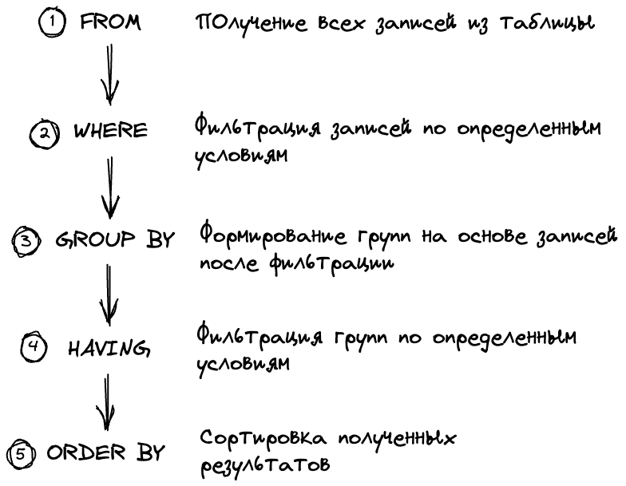
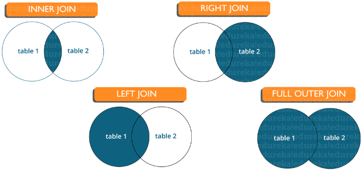

**SQL агрегирующие функции** —
Агрегирующие функции в SQL выполняют вычисления над набором значений и возвращают одно итоговое значение. Они часто
используются для получения сводной информации из данных.

- **COUNT** — возвращает количество строк в наборе данных.
- **MAX** — возвращает максимальное значение из набора данных.
- **MIN** — возвращает минимальное значение из набора данных.
- **SUM** — возвращает сумму значений в наборе данных.
- **AVG** — возвращает среднее значение из набора данных.

**SQL Оконные функции** —

Позволяют выполнять вычисления по строкам в рамках определённого окна (OVER(PARTITION BY ...)).

- **ROW_NUMBER()** – номер строки в группе
- **RANK()** – ранг строки (с пропусками при одинаковых значениях)
- **DENSE_RANK()** – ранг строки (без пропусков)

------------
**Оптимизация:**

- Оператор SELECT должен указывать имена полей.
- Использовать WHERE для уменьшения объема данных.
- Использовать LIMIT, чтобы ограничить результат.
- Добавьте индекс для часто запрашиваемых столбцов.

**SQL EXPLAIN ANALYZE** —
показать план выполнения оператора

- **EXPLAIN** отображает план запроса и предполагаемую стоимость запроса, но не выполняет сам запрос;
- **EXPLAIN ANALYZE** выполняет запрос в дополнение к отображению плана запроса, отбрасывая любой вывод оператора
  SELECT, но выполняя другие операции, например, INSERT, UPDATE или DELETE.

------------
**Порядок выполнения SQL запроса**

- Предложение FROM: Первым шагом является определение таблиц, задействованных в запросе.
- Предложение JOIN: Следующим шагом является выполнение операции объединения на основе условия объединения.
- Предложение WHERE: Третий шаг — применить условие фильтрации к объединённой таблице.
- Предложение GROUP BY: Четвёртый шаг — сгруппировать строки по указанным столбцам.
- Предложение HAVING: Пятый шаг — фильтрация групп по условию.
- Предложение SELECT: Шестой шаг — выбор столбцов и агрегатных функций из каждой группы.
- Предложение ORDER: Седьмой шаг — сортировка строк по указанным столбцам.
- Предложение LIMIT: Последний шаг — пропустить несколько строк из отсортированного набора результатов.

------------
**Prepared Statement в JDBC** — это интерфейс в JDBC API, который предоставляет механизм для предварительной компиляции
и выполнения SQL-запросов с параметрами. Основные преимущества:

**SQL-инъекции** — уязвимость веб-безопасности, позволяющая вмешиваться в запросы, которые приложение делает к своей
базе данных.
Как правило, это позволяет просматривать данные, к которым не должно быть доступа.

------------
**Join:**

**Inner join:** возвращает все строки из нескольких таблиц, для которых выполняется условие соединения.  
**Left Join:** возвращает все строки из левой (первой) таблицы и только совпадающих строк из правой (второй) таблицы,
для которых выполняется условие соединения.  
**Right Join:** возвращает все строки из правой (второй) таблицы и только совпадающих строк из левой (первой) таблицы,
для которых выполняется условие соединения.  
**Full Join:** возвращает все записи, для которых есть совпадение в любой из таблиц. Следовательно, он возвращает все
строки из левой таблицы и все строки из правой таблицы.

**DELETE VS TRUNCATE:**

- DELETE используется для удаления строк из таблицы, можно использовать WHERE для набора параметров. Фиксация и откат
  возможны.
- TRUNCATE удаляет все строки из таблицы. Откат НЕ возможен.]

**JOIN VS UNION:**

- JOIN объединяет строки таблицы по заданному условию
- UNION объединяет строки из разных таблиц или запросов в одну таблицу без условия объединения.

**HAVING:**  
Аналог WHERE, но применяется после GROUP BY 